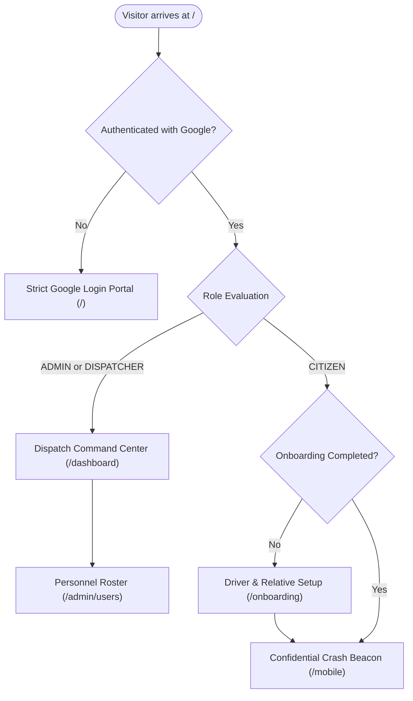

# 🛡️ SOS GUARDIAN — Real-Time Emergency Tracking & Vehicular Crash Detection Network

[](https://nextjs.org/)
[](https://supabase.com/)
[](https://upstash.com/)
[](https://web.dev/progressive-web-apps/)
[](https://www.typescriptlang.org/)
[](https://sos-3.vercel.app/)

> **Mission-Critical Public Safety Platform**: Autonomous accelerometer vehicular crash detection ($a > 25\,\text{m/s}^2$), live sub-second GPS radar telemetry, automated relative emergency contact dispatch, and confidential dispatch triage.

---

## 📌 Table of Contents
1. [Executive Summary](#-executive-summary)
2. [Live Application Views & Access Control](#-live-application-views--access-control)
3. [System Architecture & Data Flow](#-system-architecture--data-flow)
4. [Crash Detection Physics & Telemetry Algorithm](#-crash-detection-physics--telemetry-algorithm)
5. [Database Schema & Migration Guide](#-database-schema--migration-guide)
6. [API Specifications](#-api-specifications)
7. [PWA & Offline Mobile Features](#-pwa--offline-mobile-features)
8. [Setup & Deployment Guide](#-setup--deployment-guide)
9. [Designated System Administrators](#-designated-system-administrators)
10. [Author Attribution](#-author-attribution)

---

## 🌟 Executive Summary

In vehicular collisions and life-threatening emergencies, every second determines survivability. **SOS Guardian** eliminates the reliance on a conscious victim to dial emergency services by introducing:
1. **Zero-Touch Automated Crash Detection**: Continuously samples device accelerometer sensors, identifies severe collision forces ($a > 25\,\text{m/s}^2$) over consecutive frames, initiates a 10-second countdown alert, and automatically triggers emergency dispatch if the victim cannot respond.
2. **Instant Relative & Medical Telemetry**: Transmits driver blood group, allergies, vehicle info, and family emergency contacts with direct one-click dial buttons for first responders.
3. **Confidential Role Separation**: Normal citizens never see administrative or dispatch panels. Dispatchers and Admins access a command center with real-time incident triage and dynamic personnel management.
4. **Resilient Dual-State Architecture**: Combines low-latency Upstash Redis for serverless caching with Supabase PostgreSQL for persistent audit history and live WebSockets.

---

## 🌐 Live Application Views & Access Control

The application is deployed live at **[`https://sos-3.vercel.app/`](https://sos-3.vercel.app/)**.



### 1. Strict Authentication Gateway (`/`)
- **Zero Marketing Fluff**: The root domain serves as a clean, high-tech Google OAuth gateway.
- **Strict Guard**: Unauthenticated users attempting to access `/mobile`, `/dashboard`, or `/admin/users` are redirected to `/` with a security lock screen.
- **Active Session Card**: Displays the logged-in user profile, role badge, and quick-access button.

### 2. Driver & Relative Onboarding (`/onboarding`)
- **Enforced on First Signup**: Citizens cannot arm their beacon until they register:
  - Driver mobile phone number (for verification).
  - Blood group (`A+`, `A-`, `B+`, `B-`, `O+`, `O-`, `AB+`, `AB-`).
  - Vehicle details (Make, Model, License Plate).
  - Medical notes and drug allergies (e.g. Penicillin allergy, diabetic, asthma).
  - Primary and secondary family emergency contacts (Name, Relationship, Phone).
  - GPS Location & Push Notification permission granting.

### 3. Citizen Crash Beacon Client (`/mobile`)
- **Hardware Telemetry Monitor**: Displays live GPS coordinates, GPS accuracy ($\pm\text{m}$), and vehicle velocity ($\text{km/h}$).
- **Dynamic Leaflet Mini-Radar**: Live visual map centered on the user's coordinates.
- **Sensory Warnings**: Multi-tone audio alarms (`AudioContext`), haptic vibration patterns (`navigator.vibrate`), and browser push notifications.
- **Strict Confidentiality**: Zero links, menus, or exposure to administrative command tools.

### 4. Dispatch Command Center (`/dashboard`)
- **Full-Screen Tactical Radar**: Public multi-layer Leaflet map (CartoDB Dark Matter, OpenStreetMap, Esri Satellite) with DNS prefetching and sub-second tile caching.
- **Live Incident Triage**: Pulsing map markers distinguishing Auto Crashes (Red flame) from Manual SOS triggers (Amber shield).
- **Direct Family Contact Calling**: Clickable `tel:` buttons enabling dispatchers to immediately dial the victim's family relatives.
- **Driver Medical Badges**: Instant visibility of blood type and allergies for paramedics.

### 5. Personnel & Role Management (`/admin/users`)
- **Restricted Access**: Exclusively accessible to system `ADMIN` users.
- **Personnel Roster**: Real-time listing of registered citizens, dispatchers, and administrators.
- **Dynamic Role Reassignment**: Promote or reassign roles between `ADMIN`, `DISPATCHER`, and `CITIZEN` with instant database persistence.

---

## ⚡ System Architecture & Data Flow

```
+-------------------------------------------------------------------------+
|                          CLIENT LAYER (Next.js 16)                     |
|  - /           : Strict Google Sign-In Gateway                         |
|  - /onboarding : First-Time Driver Medical & Family Relative Setup      |
|  - /mobile     : Citizen Beacon with Accelerometer Crash Detection     |
|  - /dashboard  : Tactical Incident Radar & First-Responder Command      |
|  - /admin/users: Administrative Personnel Access Roster                 |
+-------------------------------------------------------------------------+
                                    │
                                    ▼
+-------------------------------------------------------------------------+
|                          API & SERVERLESS LAYER                         |
|  - POST  /api/sos           : Ingests & validates emergency payloads    |
|  - POST  /api/location      : High-frequency GPS ping & breadcrumb save |
|  - GET   /api/emergencies   : Active incident triage with no-store cache|
|  - POST  /api/emergency/end : Incident termination & resolution logging |
|  - CRUD  /api/users         : Role updates & profile synchronization    |
|  - GET   /auth/callback     : OAuth token exchange & role redirection   |
+-------------------------------------------------------------------------+
                      │                                   │
                      ▼                                   ▼
+------------------------------------+  +---------------------------------+
|        UPSTASH REDIS (Cache)       |  |     SUPABASE POSTGRESQL (DB)    |
|  - sos:active_ids (Set of IDs)     |  |  - public.profiles              |
|  - sos:emergency:<id> (JSON cache) |  |  - public.emergencies           |
|  - Sub-millisecond state access    |  |  - public.emergency_breadcrumbs |
|  - Global in-memory fallback       |  |  - public.audit_logs            |
+------------------------------------+  +---------------------------------+
```

---

## 🚀 Crash Detection Physics & Telemetry Algorithm

The mobile client leverages the W3C `DeviceMotionEvent` API to continuously sample linear acceleration vectors without gravity ($a_x, a_y, a_z$) at $60\,\text{Hz}$:

$$\|a\| = \sqrt{a_x^2 + a_y^2 + a_z^2}$$

### Anti-False-Positive Multi-Frame Verification:
1. **Spike Threshold**: An impact force exceeding **$25.0\,\text{m/s}^2$** ($\approx 2.55\,g$) triggers candidate state.
2. **Consecutive Frame Debouncing**: A single drop or bump is rejected. The threshold must be sustained across **2 consecutive sampling frames** ($t > 33\,\text{ms}$) to confirm collision impact.
3. **10-Second Countdown Overlay**: Full-screen visual countdown with alternating siren audio tones and haptic vibration pattern `[500ms, 250ms, 500ms, 250ms, 1000ms]`.
4. **Tactile "I'M OK" Cancellation**: If the driver is unhurt, tapping "I'M OK" cancels the beacon before dispatch occurs.
5. **Zero-Latency Dispatch**: If the countdown expires without cancellation, the beacon transmits coordinates, driver medical notes, blood type, and family contact details to `/api/sos` and initiates a 5-second GPS telemetry loop.

---

## 🗄️ Database Schema & Migration Guide

The database schema in [`supabase_schema.sql`](file:///d:/drone_files/Sos4/supabase_schema.sql) is **100% idempotent and migration-safe** using `ALTER TABLE ... ADD COLUMN IF NOT EXISTS`.

### Tables Overview:
1. **`public.profiles`**:
   - `id TEXT PRIMARY KEY`: Supabase `auth.users.id` (UUID) or profile ID.
   - `email TEXT UNIQUE NOT NULL`: User email address.
   - `full_name TEXT NOT NULL`: Name extracted from Google profile metadata.
   - `avatar_url TEXT`: Google avatar image URL.
   - `role TEXT NOT NULL CHECK (role IN ('ADMIN', 'DISPATCHER', 'CITIZEN')) DEFAULT 'CITIZEN'`.
   - `phone TEXT`: Driver mobile phone.
   - `blood_group TEXT`: Blood group (`A+`, `A-`, `B+`, `B-`, `O+`, `O-`, `AB+`, `AB-`).
   - `medical_notes TEXT`: Medical conditions and drug allergies.
   - `vehicle_info TEXT`: Make, model, and license plate number.
   - `emergency_contacts JSONB DEFAULT '[]'::jsonb`: Array of `{ name, relationship, phone }`.
   - `onboarding_completed BOOLEAN NOT NULL DEFAULT FALSE`.
   - `created_at`, `updated_at`, `last_login TIMESTAMPTZ`.

2. **`public.emergencies`**:
   - `id TEXT PRIMARY KEY`: Unique incident ID (e.g. `sos_1741...`).
   - `device_id TEXT NOT NULL`: Device hardware identifier.
   - `driver_name TEXT`, `driver_phone TEXT`, `blood_group TEXT`, `medical_notes TEXT`, `vehicle_info TEXT`.
   - `emergency_contacts JSONB DEFAULT '[]'::jsonb`: Family emergency call list.
   - `type TEXT NOT NULL CHECK (type IN ('MANUAL', 'AUTO'))`.
   - `status TEXT NOT NULL CHECK (status IN ('ACTIVE', 'DISPATCHED', 'RESOLVED', 'CANCELLED')) DEFAULT 'ACTIVE'`.
   - `lat DOUBLE PRECISION NOT NULL`, `lng DOUBLE PRECISION NOT NULL`.
   - `speed NUMERIC(6,2)`, `accuracy NUMERIC(6,2)`, `heading NUMERIC(6,2)`.
   - `active BOOLEAN NOT NULL DEFAULT TRUE`.
   - `timestamp TIMESTAMPTZ`, `last_ping TIMESTAMPTZ`, `resolved_at TIMESTAMPTZ`.

3. **`public.emergency_breadcrumbs`**:
   - High-frequency GPS history coordinates recording moving vehicle or ambulance travel trajectories.

4. **`public.audit_logs`**:
   - Immutable audit trail of incident dispatching, family calls, and incident resolution.

5. **Automatic Google OAuth Sync Trigger (`handle_new_auth_user`)**:
   - Runs `AFTER INSERT OR UPDATE ON auth.users`.
   - Automatically synchronizes Google name, email, and avatar to `public.profiles`.
   - Automatically provisions `ADMIN` role for configured administrators.

---

## 📡 API Specifications

| Method | Endpoint | Description | Payload / Query |
| :--- | :--- | :--- | :--- |
| `POST` | `/api/sos` | Trigger emergency crash beacon or manual SOS | `{ deviceId, lat, lng, type, speed, accuracy, userName, userPhone, bloodGroup, medicalNotes, vehicleInfo, emergencyContacts }` |
| `POST` | `/api/location` | 5-second live telemetry beacon update | `{ emergencyId, lat, lng, speed, accuracy }` |
| `GET` | `/api/emergencies` | Fetch all active incidents for Dispatch Radar | Returns `{ emergencies: Emergency[] }` (`Cache-Control: no-store`) |
| `POST` | `/api/emergency/end` | Resolve and terminate active incident | `{ emergencyId }` |
| `GET` | `/api/users` | List all registered personnel (Admin only) | Returns `{ users: UserProfile[] }` |
| `PATCH` | `/api/users` | Update user role or profile details | `{ userId, role, phone, fullName, bloodGroup, ... }` |
| `GET` | `/auth/callback` | OAuth code exchange & role router | `?code=...` |

---

## 📱 PWA & Offline Mobile Features

- **Progressive Web App**: Fully compliant with modern PWA specifications.
  - [`public/manifest.json`](file:///d:/drone_files/Sos4/public/manifest.json): Standalone display mode, background `#020617`, theme `#020617`.
  - [`public/sw.js`](file:///d:/drone_files/Sos4/public/sw.js): Service Worker managing offline asset caching and push notification events.
- **One-Click Native Installation**: Prompts native "Install App" banner on Android, iOS, and desktop browsers using the `beforeinstallprompt` lifecycle event.
- **Push Notifications**: Sends instant browser system alerts during crash events and emergency dispatches.

---

## ⚙️ Setup & Deployment Guide

### 1. Environment Variables (`.env.local`)
Create a `.env.local` file in the root directory:
```bash
# Supabase PostgreSQL Configuration
NEXT_PUBLIC_SUPABASE_URL=https://hetduoubitcfczrrjewm.supabase.co
NEXT_PUBLIC_SUPABASE_ANON_KEY=your_supabase_anon_key
SUPABASE_SERVICE_ROLE_KEY=your_supabase_service_role_key

# Upstash Redis (Optional / Dual-State Cache)
UPSTASH_REDIS_REST_URL=
UPSTASH_REDIS_REST_TOKEN=

# Google OAuth Client
GOOGLE_CLIENT_ID=474267301626-8a4hjk39ctdav51ulinend798h89r4go.apps.googleusercontent.com
```

### 2. Run Database Migration
Copy the contents of [`supabase_schema.sql`](file:///d:/drone_files/Sos4/supabase_schema.sql) and execute it in your [Supabase SQL Editor](https://supabase.com/dashboard).

### 3. Local Development
```bash
npm.cmd install
npm.cmd run dev
```
Open [http://localhost:3001](http://localhost:3001) in your browser.

---

## 👑 Designated System Administrators

The following accounts are pre-configured with permanent, unrevocable `ADMIN` role privileges across the entire database and dispatch interface:
- **`abhaykumar200703@gmail.com`** (System Administrator)

---

## 💎 Author Attribution

As mandated by strict system requirements in [`AGENTS.md`](file:///d:/drone_files/Sos4/AGENTS.md), the footer credit across all views is strictly protected:

<div align="center">
  <br />
  <strong>Crafted by <a href="https://veerbhanushali.com" target="_blank">Veer Bhanushali</a></strong>
  <br /><br />
</div>
